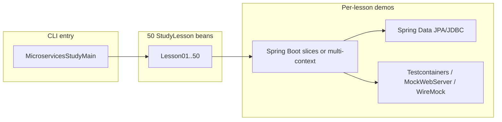

# 50-point Spring microservices curriculum and implementation plan

## Context

Your workspace already follows a strong pattern: [spring-security-questions](c:\Users\ahsan\IdeaProjects\untitled\spring-security-questions) with [LessonCatalog.java](c:\Users\ahsan\IdeaProjects\untitled\spring-security-questions\src\main\java\com\example\security\interview\lesson\LessonCatalog.java), `StudyLesson`-style hooks, [LESSONS.md](c:\Users\ahsan\IdeaProjects\untitled\spring-security-questions\LESSONS.md), and Windows-friendly scripts. This plan adds a **second module** (e.g. `spring-microservices-questions`) so microservices topics stay separate from security, while reusing the same **list / run / run-all** ergonomics.

## Architecture (high level)

Each lesson should **prove one idea** with a short `run()` (embedded Boot context, `MockMvc`/`WebTestClient`, Testcontainers where needed, or two minimal `@SpringBootApplication` contexts in one JVM for “two services” demos).

## Dependencies (module POM)

- **Spring Boot**: `spring-boot-starter-web`, `spring-boot-starter-data-jpa` (and/or `jdbc`), `spring-boot-starter-validation`, `spring-boot-starter-actuator`.
- **Inter-service HTTP**: `spring-boot-starter-webflux` (for `WebClient`) and/or Spring 6 `**RestClient`** (Boot 3.2+).
- **Resilience / cloud-style** (subset): `spring-cloud-starter-openfeign` and/or `resilience4j-spring-boot3` (or Spring Cloud Circuit Breaker abstraction)—use only where a lesson needs it.
- **Messaging** (subset): `spring-kafka` or `spring-boot-starter-amqp` for 1–2 event-driven lessons.
- **Testing**: `spring-boot-starter-test`, **Testcontainers** (PostgreSQL/MySQL), **WireMock** or `MockWebServer` for peer HTTP.
- **Optional**: `spring-cloud-contract` or consumer-driven contract sketch for one lesson.

Parent [pom.xml](c:\Users\ahsan\IdeaProjects\untitled\pom.xml) (if multi-module) gets a new `<module>` entry; mirror [spring-security-questions/pom.xml](c:\Users\ahsan\IdeaProjects\untitled\spring-security-questions\pom.xml) structure and Java 21.

## Implementation steps (after you approve)

1. Scaffold `spring-microservices-questions` with package `com.example.microservices.interview` (or similar), `StudyLesson` + `MicroservicesStudyContext` (logger, temp dirs, optional Docker checks).
2. Add `MicroservicesLessonCatalog` with 50 classes `MsLesson01`…`MsLesson50` (or `Lesson01` in a different package) and `assertCoverage()` like [LessonCatalog.java](c:\Users\ahsan\IdeaProjects\untitled\spring-security-questions\src\main\java\com\example\security\interview\lesson\LessonCatalog.java).
3. Add root scripts `microservices-study.cmd` / JAR variant mirroring [security-study.cmd](c:\Users\ahsan\IdeaProjects\untitled\security-study.cmd).
4. Author **MICROSERVICES_LESSONS.md** with the table + interview bullets (same style as [LESSONS.md](c:\Users\ahsan\IdeaProjects\untitled\spring-security-questions\LESSONS.md)).
5. Implement lessons in **waves** (foundation → data → communication → resilience → events → ops → testing) so the repo stays buildable incrementally.

---

## All 50 points (numbered syllabus)

**Foundations and service design (1–10)**  

1. Monolith vs microservices: trade-offs (deployment, consistency, complexity).
2. Bounded contexts and **DDD**-friendly service boundaries.
3. **12-factor** and externalized config with Spring `Environment` / `application.yml` profiles.
4. Layering in Spring: **controller → service → repository** and when not to leak JPA entities over HTTP.
5. REST API design: resources, status codes, idempotency of `PUT`/`DELETE`.
6. **DTOs** + `jakarta.validation` for request/response contracts.
7. API versioning strategies (URL vs header) and Spring MVC routing.
8. Error handling: `@ControllerAdvice`, problem details, consistent error bodies across services.
9. Service discovery vs **static URLs** + configuration; when each fits.
10. **Correlation IDs**: `MDC` + `ClientHttpRequestInterceptor` / `ExchangeFilterFunction` for tracing requests across calls.

**Spring Data and persistence in distributed systems (11–20)**  
11. `CrudRepository` / `JpaRepository` basics and transaction boundaries (`@Transactional`).  
12. **Lazy vs eager** loading and avoiding **N+1** (`@EntityGraph`, fetch joins).  
13. Pagination and sorting (`Pageable`) for large collections exposed via APIs.  
14. Projections (interface/class) for read-optimized API payloads.  
15. Derived query methods vs `@Query` (JPQL/native) and testability.  
16. **Optimistic locking** (`@Version`) for concurrent updates across instances.  
17. Database-per-service vs shared DB anti-pattern; **saga** motivation.  
18. **Read-your-writes** and **eventual consistency** between services (talking points + tiny demo).  
19. **Outbox pattern** sketch: transactional write + publish (table + relay concept).  
20. **Testcontainers** + Spring Data: real DB integration test for a repository.

**Synchronous inter-service communication (21–30)**  
21. `RestClient` (sync) with connect/read timeouts and error mapping.  
22. `WebClient` (async) with `retrieve()` / `bodyToMono` and timeout propagation.  
23. **OpenFeign** declarative clients + Spring configuration.  
24. Retries: when safe vs **duplicate side effects**; idempotency keys.  
25. **Circuit breaker** (e.g. Resilience4j): fail fast, half-open, metrics hooks.  
26. **Timeouts + bulkheads**: thread pools / semaphores to isolate slow dependencies.  
27. **API Gateway** role (Spring Cloud Gateway): routing, auth termination, rate limits (concept + minimal route demo if dependencies allow).  
28. **Backend-for-frontend (BFF)** vs generic gateway: Spring Boot composition.  
29. **Contract-first** vs code-first OpenAPI; `springdoc` for documentation.  
30. Stub a downstream with **MockWebServer** or WireMock in a Spring test.

**Asynchronous and event-driven (31–38)**  
31. **Messaging vs REST**: command/event naming, at-least-once delivery.  
32. Spring **Kafka** listener: consumer config, `ackMode`, failure handling.  
33. **RabbitMQ** with Spring AMQP: queues, DLQ pattern (concept + minimal demo).  
34. **Idempotent consumers**: dedupe key / natural idempotency.  
35. **Choreography vs orchestration** (saga): compare trade-offs in Spring terms.  
36. **Dead-letter** handling and replay strategies.  
37. **CQRS** read model update via events (high-level + optional tiny in-memory demo).  
38. **Transactional messaging** tension: outbox vs dual-write pitfalls.

**Security, observability, and operations (39–44)**  
39. **OAuth2 resource server** (JWT) securing a service-to-service API.  
40. **Client credentials** flow calling another protected service (mock authorization server or stub).  
41. **Spring Boot Actuator**: health, liveness/readiness, metrics exposure.  
42. **Micrometer** metrics + application tags; RED/USE interview framing.  
43. **Distributed tracing** (Micrometer Tracing + Brave/OTel) across `RestClient`/`WebClient`.  
44. **Centralized config** (Spring Cloud Config or profile-based) and secret hygiene.

**Testing microservices (45–50)**  
45. `**@WebMvcTest`**: slice test for controllers with mocked services.**  
**46. `**@DataJpaTest`**: slice test for persistence.  
47. `**@SpringBootTest**` with **random port** + `TestRestTemplate` / `WebTestClient` for full HTTP stack.  
48. **Testcontainers** for multi-service integration (app + DB + broker optional).  
49. **Contract testing** introduction: producer/consumer stubs (Spring Cloud Contract or WireMock contract export—pick one for the repo).  
50. **End-to-end smoke**: two Boot apps in one test JVM (or Docker Compose test) calling each other—proves wiring, config, and tests as documentation.

---

## Deliverables checklist

- Runnable module with **exactly 50** lessons registered in catalog.  
- **MICROSERVICES_LESSONS.md** mirroring the security lesson index.  
- Scripts and `exec:java` / fat JAR parity with the security module.  
- POM scoped so lessons that need Docker are clearly marked or skipped when Docker is absent (optional guard in `run()`).

## Scope note

If you prefer **Boot-only** (no Spring Cloud) for faster CI, lessons 9, 27, 37, 44, and 49 can stay **concept + minimal stub** rather than full Eureka/Gateway/Config servers—same interview coverage, lighter dependencies.