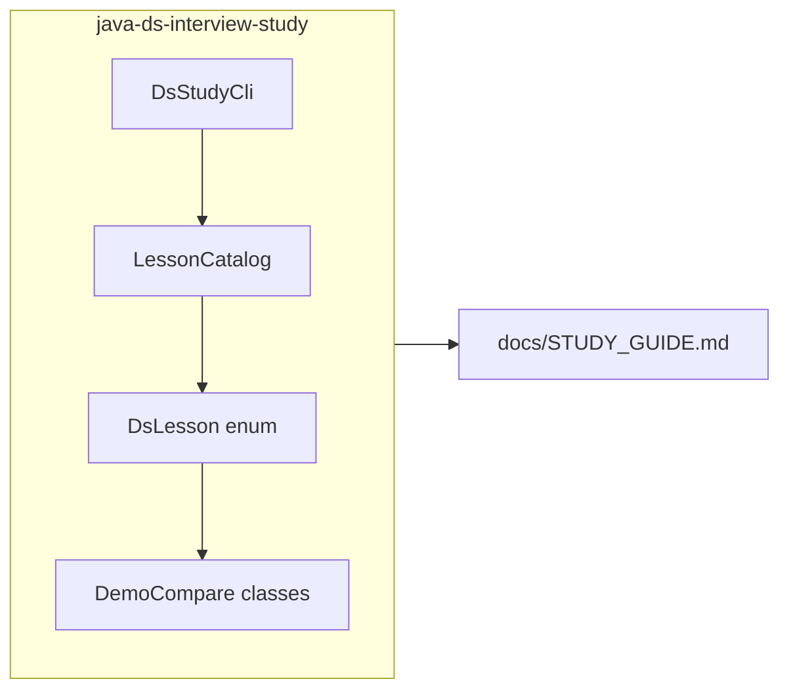

# Java data structures + code-first comparisons

## Context

The repo’s pattern is: **Maven module + Picocli CLI** (`list`, `run`, `run-all`) + **`interview-study-cli-support`** for `run-all` behavior + **one** narrative index file per module ([guide.md](c:\Users\ahsan\IdeaProjects\untitled\guide.md) links those guides). The concurrency module is already a **62-lesson** enum-driven catalog ([ConcurrencyLesson.java](c:\Users\ahsan\IdeaProjects\untitled\concurrency-interview-study\src\main\java\com\example\concurrency\interview\lesson\ConcurrencyLesson.java)); mixing unrelated “pure DS” topics there would blur scope and force awkward numbering.

## Recommended approach

Introduce a **new sibling module** (artifact id e.g. `java-ds-interview-study`) that mirrors the **lightweight** layout of [jpa-interview-study/pom.xml](c:\Users\ahsan\IdeaProjects\untitled\jpa-interview-study\pom.xml): **no Spring, no Kafka**—JDK **`java.util`** / **`java.util.concurrent`** (for one blocking-queue comparison), **`java.util.stream`** only if a lesson needs it, Picocli, and `interview-study-cli-support`.

## Lesson shape (answers = code + comments)

For each `DsLesson`, the `run(StudyContext ctx)` path should:

1. Log a **single interview-style question** (one line).
2. Execute **two or three comparable code paths** in the same JVM run (static methods in `com.example.javads.interview.demos`, grouped logically e.g. `DemoListCompare`, `DemoMapCompare`).
3. Log **observable results**: iteration order, duplicate/`null` behavior, iterator fail-fast notes where relevant, and **optional** `System.nanoTime()` before/after with a short log disclaimer (micro-benchmarks are noisy; purpose is *relative* intuition, not JMH rigor).

### Documentation and commenting standard (required for implementation)

**Goal:** You can read a demo class and understand **what each method is for** and **what interview point it proves**, without needing a comment on every single line.

- **Every lesson entry method** (e.g. `l01`, `l02`, … on demo classes, or the static method invoked from the enum `switch`) **must have a Javadoc** (or equivalent block above the method) that explicitly states:
  - **Purpose** — what scenario or API is being exercised.
  - **Role** — how this method fits into the lesson (e.g. “Path A: baseline”, “Path B: contrast”, “setup”, “assert observable behavior”).
  - **Demonstration** — the concrete takeaway for an interviewer (e.g. “shows fail-fast”, “shows O(n) vs O(log n) lookup”, “shows aliasing after `List.of`”).
- **Detailed comments inside the method** for any **non-obvious** logic: setup sizes, why a loop is structured a certain way, complexity or allocation notes, API traps (`Comparator` contract, `binarySearch` precondition, iterator invalidation). Use **multi-line block comments** where a whole phase (warmup, timed section, verification) needs explanation.
- **Do not** require “comment every line”; **do** require that someone new to the file can follow the story **method-by-method** and through **commented blocks** for tricky segments.
- **Class-level Javadoc** on each `Demo*` type: one short paragraph naming the lesson domain and listing which lesson numbers it serves.

The runnable Java source remains the **primary** study artifact; [docs/STUDY_GUIDE.md](c:\Users\ahsan\IdeaProjects\untitled\concurrency-interview-study\docs\STUDY_GUIDE.md) stays **short** (how to run, one paragraph per lesson pointing at the **class + method names** to open).

## DSA / collections lesson set (target ~20 lessons, all code-first)

Core lists, maps, sets, queues (1–10):

| #   | Comparison focus                                                                                                                              |
| --- | --------------------------------------------------------------------------------------------------------------------------------------------- |
| 1   | `ArrayList` vs `LinkedList` — tail append vs prepend/middle inserts; random `get(i)` cost                                                     |
| 2   | `HashMap` vs `LinkedHashMap` vs `TreeMap` — iteration order, `Comparator`, `null` key rules                                                   |
| 3   | `HashSet` vs `LinkedHashSet` vs `TreeSet` — ordering; `equals`/`hashCode` pitfall vs correct tiny type                                        |
| 4   | `ArrayDeque` vs `LinkedList` as `Deque` — default choice and allocation patterns                                                              |
| 5   | `PriorityQueue` vs `TreeSet` — duplicates, ordering, “smallest K” style usage                                                                 |
| 6   | `ConcurrentHashMap` vs `Collections.synchronizedMap(new HashMap<>())` — locking granularity; weakly consistent vs fully synchronized iterator |
| 7   | `List.of` vs `Collections.unmodifiableList` vs `new ArrayList<>(copy)` — mutability and aliasing traps                                        |
| 8   | `HashMap` presized constructor vs default — resize/rehash cost (two timed builds, commented)                                                  |
| 9   | `IdentityHashMap` vs `HashMap` — `==` vs `equals` keys (when each applies)                                                                    |
| 10  | `EnumMap` vs `HashMap` with enum keys — memory and performance characteristics                                                                |

Algorithms on arrays / strings / sorting (11–14), still runnable JDK demos:

| #   | Comparison focus                                                                                               |
| --- | -------------------------------------------------------------------------------------------------------------- |
| 11  | `Arrays.binarySearch` on sorted `int[]` vs linear scan — when binary search wins; insertion-point return value |
| 12  | `Arrays.sort` vs `Arrays.parallelSort` — same data, relative timing + “when parallel hurts” comments           |
| 13  | Building a string in a loop: `String` `+=` vs `StringBuilder` — allocation churn (timed, commented)            |
| 14  | `Collections.binarySearch` on sorted `List` vs linear `indexOf` — random-access list vs `LinkedList` gotcha    |

Iteration, removal, and legacy APIs (15–17):

| #   | Comparison focus                                                                                   |
| --- | -------------------------------------------------------------------------------------------------- |
| 15  | Removing while iterating: `Iterator.remove()` vs `for-each` + `Collection.remove` (fail-fast demo) |
| 16  | Stack behavior: `ArrayDeque` as stack vs legacy `java.util.Stack` — why `Stack` is discouraged     |
| 17  | `NavigableSet` / `TreeSet`: `ceiling` / `floor` / range views vs scanning a sorted `ArrayList`     |

Concurrency-flavored collections (18–19):

| #   | Comparison focus                                                                                                                                            |
| --- | ----------------------------------------------------------------------------------------------------------------------------------------------------------- |
| 18  | `CopyOnWriteArrayList` vs `Collections.synchronizedList(new ArrayList<>())` — read-heavy vs write-heavy                                                     |
| 19  | `BlockingQueue` flavors (same module can import `j.u.c`): `ArrayBlockingQueue` vs `LinkedBlockingQueue` — bounded array vs linked nodes; capacity semantics |

Specialized / misc (20):

| #   | Comparison focus                                                                          |
| --- | ----------------------------------------------------------------------------------------- |
| 20  | `BitSet` vs `boolean[]` — packed bits vs one byte per slot (memory + tiny operation demo) |

**Optional stretch (21–22)** if you want even more DSA surface without leaving the JDK: `WeakHashMap` vs `HashMap` (comment-only caution: GC timing nondeterministic—show API contract in code, avoid asserting GC); `Arrays.equals` / `Arrays.hashCode` vs `Object` equality on array fields (common bug).

Use a single `EXPECTED_LESSON_COUNT` on the enum (same pattern as `ConcurrencyLesson.EXPECTED_LESSON_COUNT`) and **`LessonCatalog.assertCoverage()`** in CLI `main`, matching [ConcurrencyStudyCli.java](c:\Users\ahsan\IdeaProjects\untitled\concurrency-interview-study\src\main\java\com\example\concurrency\interview\cli\ConcurrencyStudyCli.java).

## Wiring and docs

- Register the module in the parent [pom.xml](c:\Users\ahsan\IdeaProjects\untitled\pom.xml) `<modules>`.
- Add `java-ds-interview-study/pom.xml` with `exec-maven-plugin` + `maven-jar-plugin` manifest `mainClass` (copy the **non–Spring Boot** style from JPA; DS module does not need `spring-boot-maven-plugin`).
- Implement `DsStudyCli` with `list` / `run` / `run-all` delegating failures to `StudyRunAllExecutor` like concurrency’s `RunAll` subcommand.
- Add [java-ds-interview-study/docs/STUDY_GUIDE.md](java-ds-interview-study/docs/STUDY_GUIDE.md): Maven examples (`mvn -pl java-ds-interview-study exec:java -Dexec.args="list"`), per-lesson index, and a **“Conference / tight prep selection”** subsection: a **curated ordered list of lesson numbers** combining e.g. concurrency **queues + backpressure + pools** (e.g. 32–35, 47–50, 51–54—exact numbers finalized during implementation) **with** a **subset** of DS lessons (e.g. high-yield 1–6, 11–12, 15–16, 18–19) or a **full DS run** `run-all` when time allows—document both a **minimal** and **full** track.
- Update the learning table in [guide.md](c:\Users\ahsan\IdeaProjects\untitled\guide.md) to include the new module’s `STUDY_GUIDE.md` link (repo convention).

## Verification

From repo root: `mvn -pl java-ds-interview-study -q compile exec:java -Dexec.args="run-all"` and spot-check `run 1`.

## Non-goals (unless you later expand scope)

- Full LeetCode solution bank or third-party DS libraries.
- Moving or renumbering existing concurrency lessons (62 stays intact).

