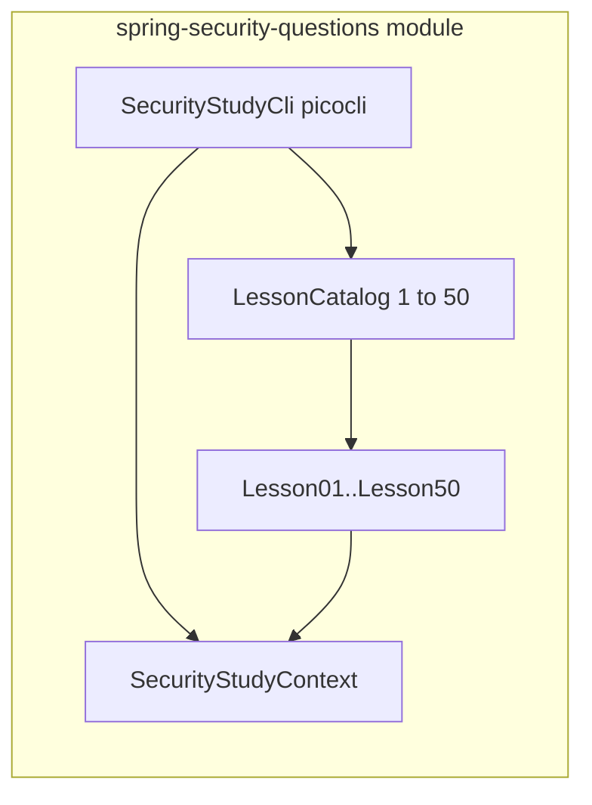

# Spring Security: 50 hands-on lessons (Java + markdown)

## Context

- [spring-security-questions/README.md](c:\Users\ahsan\IdeaProjects\untitled\spring-security-questions\README.md) currently only states the goal; the directory has no code yet.
- [jpa-interview-study](c:\Users\ahsan\IdeaProjects\untitled\jpa-interview-study) defines the pattern to mirror: `[StudyLesson](c:\Users\ahsan\IdeaProjects\untitled\jpa-interview-study\src\main\java\com\example\jpa\interview\study\StudyLesson.java)`, `[AbstractLesson](c:\Users\ahsan\IdeaProjects\untitled\jpa-interview-study\src\main\java\com\example\jpa\interview\lesson\AbstractLesson.java)`, `[LessonCatalog](c:\Users\ahsan\IdeaProjects\untitled\jpa-interview-study\src\main\java\com\example\jpa\interview\lesson\LessonCatalog.java)`, picocli CLI with `list` / `run <n>` / `run-all`, and `assertCoverage()` guarding 1–50 coverage.
- Parent [pom.xml](c:\Users\ahsan\IdeaProjects\untitled\pom.xml) has **no Spring Boot** today; the new module will introduce it via `dependencyManagement` (Spring Boot BOM) without forcing Boot onto `app` or `jpa-interview-study`.

## Lesson quality bar (updated)

- **Every lesson is hands-on**: `run()` must exercise Spring Security APIs or a minimal Boot/test setup and produce **observable, assertable behavior** (e.g. `MockMvc` status/body, thrown `AuthenticationException`/`AccessDeniedException` caught and summarized, `Jwt` parsed from a locally built token, `PasswordEncoder` match result, `FilterChainProxy` invocation, `SecurityContextHolder` contents after a filter, session attribute / cookie side effect where relevant).
- **No print-only lessons**: Do not implement lessons whose sole body is “Question / talking points” printed to stdout. Interview phrasing and pitfalls live in **[spring-security-questions/LESSONS.md](c:\Users\ahsan\IdeaProjects\untitled\spring-security-questions\LESSONS.md)** only.
- **Topic scale**: All 50 titles are chosen so that together they **span the Spring Security “module map”** (Servlet stack, core abstractions, password and user details, CSRF/CORS/headers, sessions, OAuth2/OIDC client and resource server, SAML2 and LDAP entry points, crypto helpers, testing support, and reactive security). Where an integration is too heavy for a tiny demo (e.g. full IdP), the lesson still **loads the relevant auto-configuration or beans** and demonstrates the hook (e.g. SAML `RelyingPartyRegistration` builder, LDAP `BindAuthenticator` with embedded UnboundID or `ldap://` test fixture) rather than printing prose.

## Architecture

- **Package**: `com.example.security.interview` (lesson, cli, study, and small shared `demo` config classes).
- `**SecurityStudyContext`**: Facade for shared helpers—`PasswordEncoder`, building short-lived `AnnotationConfigApplicationContext` / `MockMvc` / `FilterChainProxy` where needed; **always close** contexts so `run-all` stays reliable. Optional shared test utilities (e.g. HMAC signing for JWT demos) live next to lessons, not duplicated 50 times.

## Maven setup

- Add `<module>spring-security-questions</module>` to the parent [pom.xml](c:\Users\ahsan\IdeaProjects\untitled\pom.xml).
- In the parent `dependencyManagement`, import `**spring-boot-dependencies`** (3.x, Java 21).
- New [spring-security-questions/pom.xml](c:\Users\ahsan\IdeaProjects\untitled\spring-security-questions\pom.xml): `spring-boot-starter-security`, `spring-boot-starter-web` (for servlet `MockMvc` lessons), `spring-boot-starter-oauth2-client` / `spring-boot-starter-oauth2-resource-server` as needed, `spring-security-ldap` + **embedded LDAP test server** (or UnboundID) for LDAP lesson, `spring-security-saml2-service-provider` (or current SAML2 starter) for SAML2 registration lesson, `spring-boot-starter-webflux` **only if** one reactive chain lesson is included, `spring-security-test`, `picocli`, `exec-maven-plugin` pointing at `SecurityStudyCli`. Prefer BOM-managed versions.

## 50-topic coverage map (lessons 1–50, all hands-on)

Wording can be tightened per class title; numbering below is the `LessonNN` order.

**Core and servlet foundation (1–8)**

1. Authentication vs authorization—demonstrate both via one `SecurityFilterChain` (`MockMvc`: anonymous denied, authenticated allowed).
2. `SecurityContext` and `SecurityContextHolder`—set/clear/read around a simulated request scope.
3. `Authentication` and `GrantedAuthority`—`UsernamePasswordAuthenticationToken` + authorities; access decision uses them.
4. `ProviderManager` / multiple `AuthenticationProvider`—two providers; first successful wins.
5. Multiple `SecurityFilterChain` beans—`securityMatcher` order; different rules per path.
6. `HttpSecurity` defaults vs custom—default deny vs `permitAll` for `/public/`**.
7. `RequestCache` and saved request—redirect to login preserves original URL; resume after auth (`MockMvc`).
8. Filter order—custom `OncePerRequestFilter` before/after `UsernamePasswordAuthenticationFilter` (record execution order).

**Passwords and user storage (9–13)**

1. `PasswordEncoder` (BCrypt)—encode, `matches`, wrong password fails.
2. `DelegatingPasswordEncoder` / `{id}` prefix—migration-style passwords in one store.
3. `UserDetailsService` and `UserDetails`—load success vs `UsernameNotFoundException`.
4. `DaoAuthenticationProvider`—encoder + `UserDetailsService`; success and failure paths.
5. In-memory user factory vs custom `UserDetailsService` bean—swap implementation, same chain.

**Login, logout, session (14–19)**

1. Form login—POST credentials; session becomes authenticated.
2. HTTP Basic—challenge and authenticated Basic request.
3. Logout—session/context cleared; next request anonymous.
4. Session fixation—new session id after authentication (inspect cookie).
5. Concurrent sessions—max sessions = 1; second login invalidates first (`SessionRegistry`).
6. Remember-me—remember-me cookie yields authenticated access on a later request.

**Request authorization (20–24)**

1. `authorizeHttpRequests` + `requestMatchers`—role/authority URL rules.
2. `permitAll` / `denyAll` / `authenticated`—small matrix of endpoints.
3. `fullyAuthenticated` vs remember-me—authorization differs when session is remember-me-only.
4. `hasRole` / `hasAuthority` / `hasAnyRole`—explicit demonstrations.
5. Path matcher pitfalls—e.g. trailing slash or servletPath vs requestURI; show fix.

**Method security (25–29)**

1. `@EnableMethodSecurity`—annotations enforced on a bean.
2. `@PreAuthorize` / `@PostAuthorize`—SpEL deny or filter result.
3. `@Secured` vs JSR-250 `@RolesAllowed`—same bean, different metadata.
4. `@AuthenticationPrincipal`—custom principal type on controller/service (test slice).
5. Custom `PermissionEvaluator`—`hasPermission` in SpEL.

**CSRF, CORS, headers (30–32)**

1. CSRF—POST without token fails; with token/cookie pattern succeeds.
2. CORS—`OPTIONS` preflight and `Access-Control-`* with security config.
3. Security headers—HSTS, frame options, content-type nosniff; assert on response.

**OAuth2, OIDC, JWT (33–37)**

1. OAuth2 Resource Server (JWT)—valid Bearer accepted; bad JWT rejected (`NimbusJwtDecoder` + local key).
2. Resource server—`JwtAuthenticationConverter` maps claims to authorities.
3. OAuth2 Client—`ClientRegistration` + `MockWebServer` (or stub) for token response (minimal).
4. OIDC—locally signed ID token; validate iss/aud and read claims.
5. Opaque token—custom `OpaqueTokenIntrospector` (in-memory stub).

**Integrations (38–40)**

1. SAML2 SP—`RelyingPartyRegistration` from static metadata fixture (no live IdP).
2. LDAP—bind auth against embedded LDAP (e.g. UnboundID) with test user.
3. X.509 / pre-auth—client cert or `RequestAttributeAuthenticationFilter` with preset cert attribute (executable path).

**Advanced (41–45)**

1. `AuthenticationEntryPoint` vs `AccessDeniedHandler`—401 vs 403.
2. `ExceptionTranslationFilter`—custom handlers by exception type.
3. `RunAsManager`—`RUN_AS_ROLE` after run-as invocation.
4. `SwitchUserFilter`—impersonate and exit (minimal two-user setup).
5. ACL—`MutableAclService` / `JdbcMutableAclService` + H2: grant/revoke and `hasPermission`-style check.

**Crypto and testing (46–49)**

1. `spring-security-crypto`—`BytesKeyGenerator`, secure random usage aligned with framework patterns.
2. `@WithMockUser`—contrast synthetic principal with real form login in `MockMvc`.
3. `@WithSecurityContext`—factory builds reusable `SecurityContext` for a lesson run.
4. `SecurityMockMvcRequestPostProcessors`—`.user()` / `.authentication()` on requests.

**Reactive (50)**

1. `SecurityWebFilterChain` (WebFlux)—`/api/`** requires authentication; prove with `WebTestClient`.

## Implementation steps

1. **Scaffold module**: `pom.xml`, `SecurityStudyCli`, `StudyLesson`, package-private `AbstractLesson`, `SecurityStudyContext`, `LessonCatalog.assertCoverage()`.
2. **Implement lessons 1–50** following the map above; adjust order only if dependency between demos requires (document in LESSONS.md).
3. **LESSONS.md**: For each lesson—number, title, one-line **what the run proves**, `mvn` command, and **interview bullets** (this is where prose and pitfalls live).
4. **README**: How to run CLI; link to LESSONS.md; note needed ports/files for embedded LDAP `run` if any.
5. **Verify**: `list`, several `run n`, and `run-all` with no resource leaks.

## Risks / constraints

- **Dependencies**: OAuth2/SAML/LDAP/reactive add weight—keep each lesson’s context minimal and tear down after `run()`.
- **JWT demos**: Local keys / `MockWebServer` only; no external IdP calls in default path.
- **Scope**: Do not refactor unrelated modules; parent POM only gains BOM + module entry as needed.

